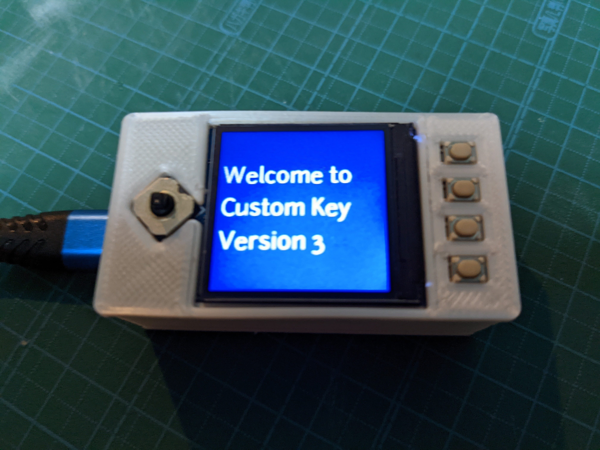
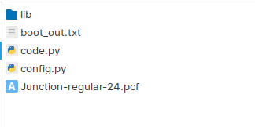
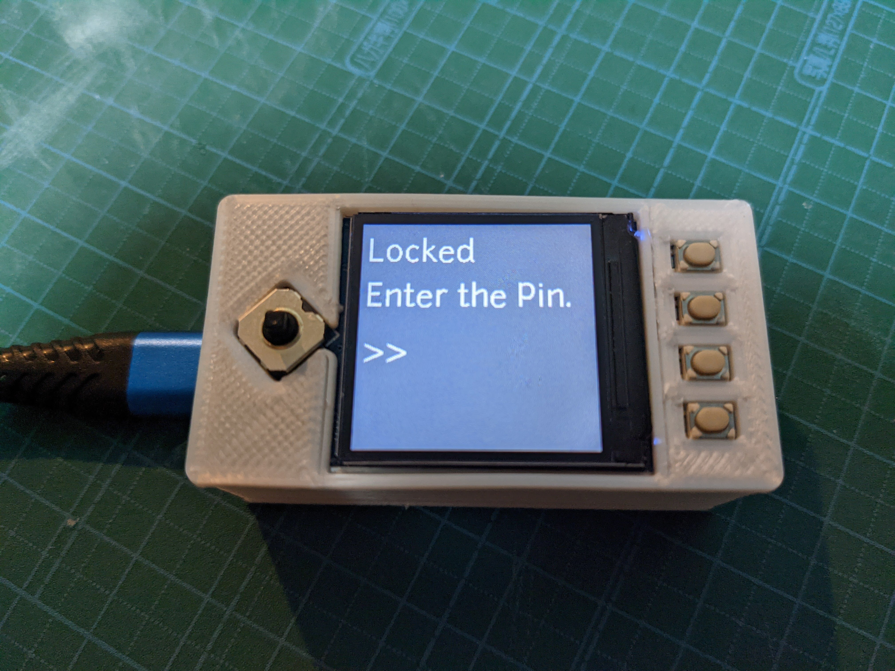
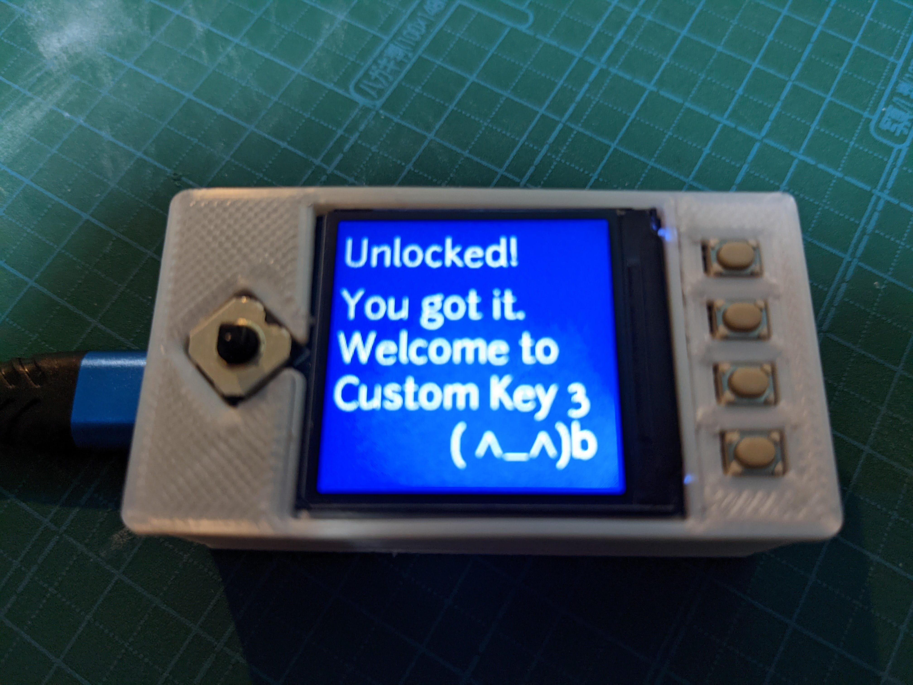
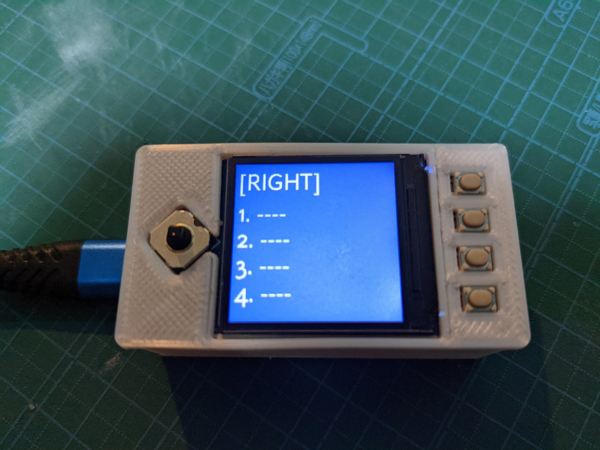

# Pico Macro Key Hat
Waveshare製のPico LCD 1.3 inch を利用したマクロキーボードです。
*特徴*
- ジョイスティック5方向（センタープッシュ含む） x 4 パターンのマクロを登録可能
- パスワードロック
- 日本語、英語キーボードに対応



# 実装
## 準備するもの
* Rasberry pi pico
* Pico LCD 1.3 inch  
  マニュアル: https://www.waveshare.com/wiki/Pico-LCD-1.3  
  スイッチサイエンスのページ　https://www.switch-science.com/catalog/7327/
* 3D Printer (任意)

## Raspberry pi pico のセットアップ
1. Circuit Python のインストール (7.x)  
2. srcフォルダ以下のソースをコピーします Raspberry Pi Pico  
[src](src)   


```
もし、CircuitPython6.x以下を利用する場合は、adafruit bundleの6.x以下から libフォルダ内のmpyファイルを置き換えてください。  
(コンパイル後のバイナリがVer7から変更されたようです。)
```

## 回路実装
WareshareのLCDはRaspberry Pi Picoがそのままはめられるようになっています。  
Raspberry pi picoのヘッダピン付きを使うか、ヘッダピンを自分で半田付けして組み合わせてください。

## ケース作成
３Dプリンタを利用してケースを印刷して、ケース下部にRaspberryをセット後、ケースの蓋を接着してください。  
BOOTSELボタンに穴があいているので、プログラムのインストールし直しはできます。
（CADデータは私のEnder3Proに合わせて作られています。細部がずれている場合があるのでご注意ください。）
  
#### スライスデータ (for 3D Printing)
- cad/CE3PRO_top-cover-Body.gcode
- cad/CE3PRO_bottom-box-Body.gcode

#### Free CAD 用データ (編集したい場合はこちらから)
- cad/top-cover.FCStd
- cad/bottom-box.FCStd

## テスト
1. 作ったものとPCをUSBケーブルで接続
2. "Welcome"メッセージが表示されます

3. ロックスクリーンが表示されます（デフォルトは　A > B > X > Y > ジョイスティックプッシュ）

4. アンロックメッセージが表示されます。

5. メイン画面が表示されます。ジョイスティックでパターンを選択、ボタンでマクロをPCに送信します。


## 設定
Raspberry Pi Picoにコピーした config.py を編集して保存してください。

|  設定  |  概要  |  値  |
| ---- | ---- | ---- |
|  uselock  |  起動時やロック時にPin要求するかを設定します  |  True:利用する False:利用しない（スキップ）  |
|  lockpin  |  ロック解除のPinを配列で設定します  |  A B X Y を半角大文字で配列に設定します。  |
| layoutType  |  USキーボード入力かJPキーボード入力かを指定します  |  "en" または "jp"  |
| keymap  |  マクロ設定をします  |  以下参照  |
| keymap > data |  マクロ文字列、画面に表示するマクロ名を設定します。必ず中の配列は３つで設定してください。  |  以下参照  |
| keymap > data > label |  LCD画面に表示される名称です  |  半角英数字  |
| keymap > data > value |  ボタンを押したときに入力される文字列です  |  半角英数字（タブ等も可能）  |

## その他
PCによってはUSBからの電流が足りずに動作が不安定になります。

