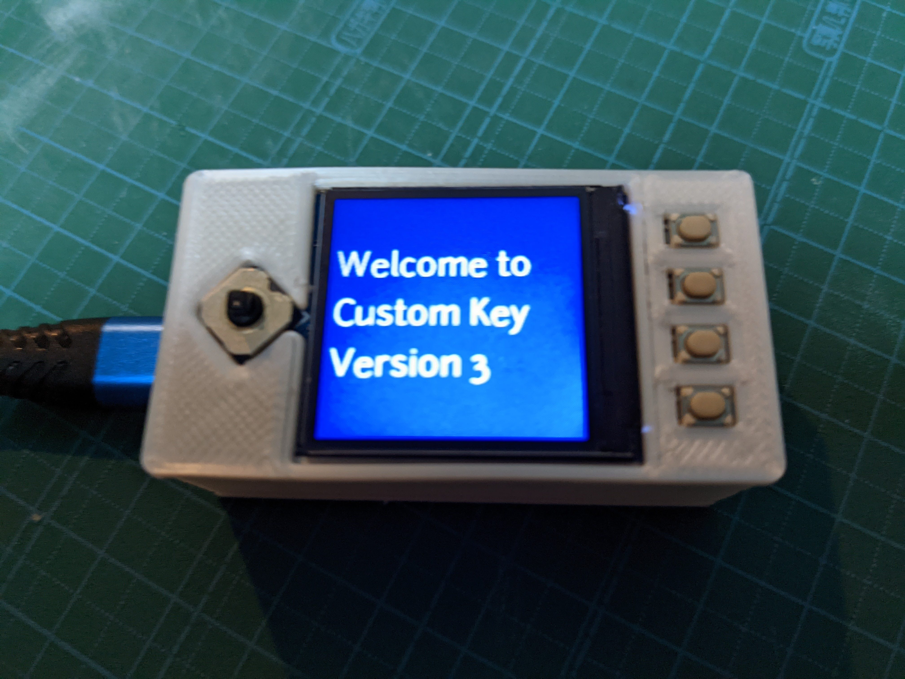
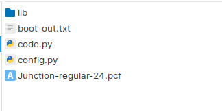
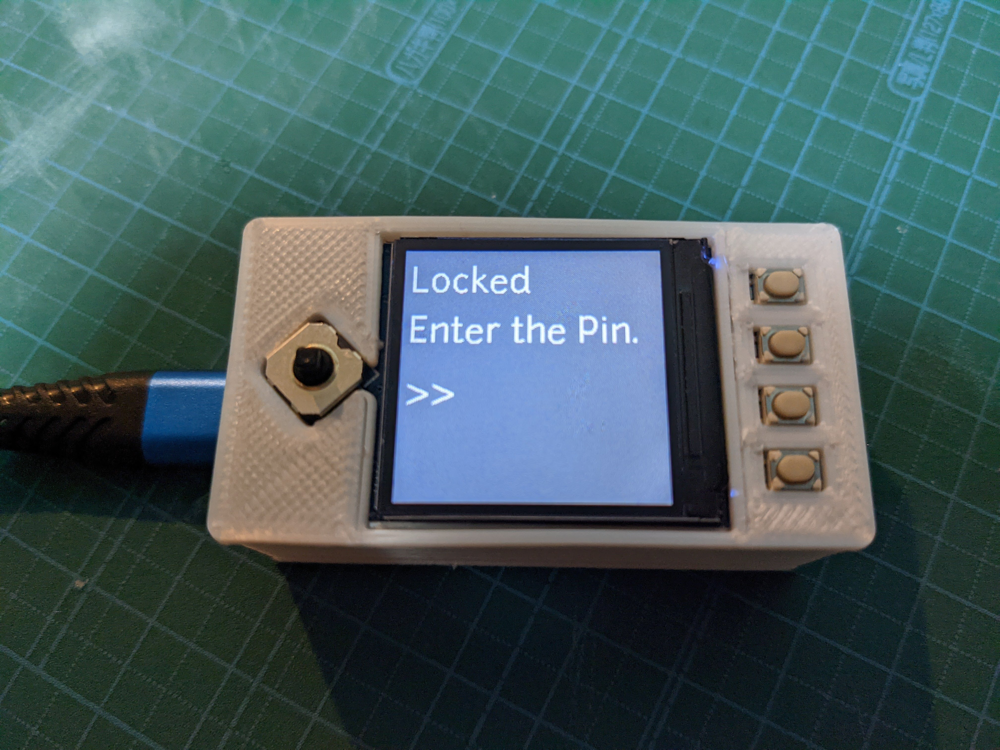
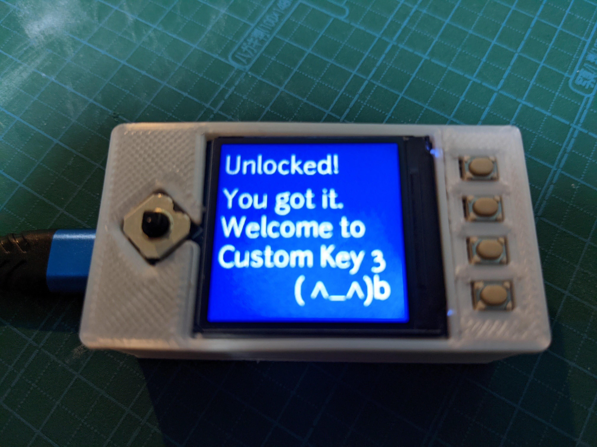
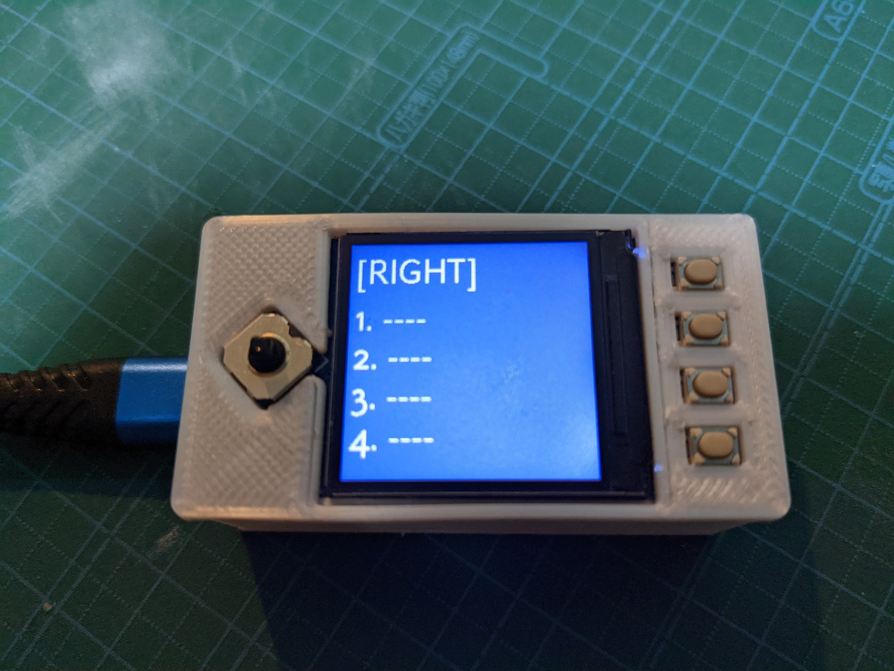

日本語話者のかたには [README.jp.md](/README.ja.md) を用意してあります。  
If you are Japanese speaker, we have [README.ja.md](/README.ja.md) for you.

# Pico Macro Key Hat
Macro key board with Pico LCD 1.3 inch Hat by Waveshare.
*Features*
- Register 5 (joystick) x 4 macro
- Pin Lock
- Japanese or English Keyboard layout



# Implemantation
## Prepare
* Rasberry pi pico
* Pico LCD 1.3 inch
  manual: https://www.waveshare.com/wiki/Pico-LCD-1.3
* 3D Printer (Optional)

## Set up Raspberry pi pico 
1. Install Circuit Python (7.x)  
2. Copy source code to root directory of Raspberry Pi Pico  
[src](src)   


```
If you would install CircuitPython ver 6.x under, you need to replace all mpy file in "lib" directory with adafruit bundle.
```

## Circuit Installation
Wareshare Pico LCD 1.3 inch is designed for Rasberry pi pico.  
You just need to solder the pin header on pi pico to place on LCD.

## Case Printing
Print the case with 3D Printer.
(Please mind that CAD data is ajusded for my Ender3 Pro. There are some not accurate things.)
  
#### Slice Data (for 3D Printing)
- cad/CE3PRO_top-cover-Body.gcode
- cad/CE3PRO_bottom-box-Body.gcode

#### Free CAD Data (If you wanna modify.)
- cad/top-cover.FCStd
- cad/bottom-box.FCStd

## Testing
1. Connect Pico Macro Key Hat to PC with USB cable.
2. You can see the display waking up with "Welcome"

3. Lock Screen (Default pin: A > B > X > Y > Joystick Center Push)

4. Unlock message is shown.

5. Macro Pattaern is shown on display. You can change the set wich Joystick. Push button to send Macro to PC. 


## Configuration
Plese edit "config.py" in Raspberry Pi Pico root directory.

|  Setting Name  |  Exp  |  Value  |
| ---- | ---- | ---- |
|  uselock  |  Use Lock Screen when waking up and locking  |  True or False  |
|  lockpin  |  Lock pin no. as Array  |  A or B or X or Y (Upper letter)  |
| layoutType  |  Designating keyboard layout  |  "en" or "jp"  |
| keymap  |  Macro setting  |  (see below)  |
| keymap > data |  Macro setting for each button. It should contain 4 item in Array  |  (see below)  |
| keymap > data > label |  Label for display in LCD  |  1byte Numeric / Alphabet / Simbol  |
| keymap > data > value |  Command when button is pressed down  |  1byte Numeric / Alphabet / Simbol / Tab  |
